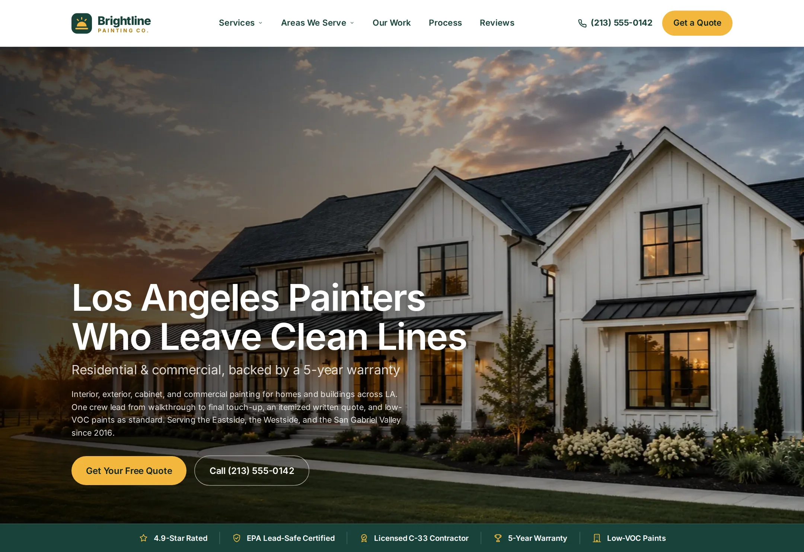

# Brightline Painting Co.

Lead-generation website for a residential and commercial painting contractor in Los Angeles.

**Live demo:** https://www.freelancerportfoliohub.com/jameslee/projects/brightline/index.html



## Overview

Brightline's site is built around one conversion: a free, written quote. Every page carries a
click-to-call number, the quote form and local proof (reviews, recent projects, licensing,
lead-safe certification and the 5-year warranty). Neighborhood landing pages are generated from
typed data, each with its own copy about local architecture, climate and access, area FAQs,
recent projects and links to nearby service areas.

## Features

- **Home**: hero with trust strip, services overview, service-area directory, recent-projects
  carousel, why-us, six-step process, review marquee, FAQs and the quote form
- **Services**: every service grouped into painting, prep and repair, and specialty, with
  anchors used by the mega menu and neighborhood pages
- **Neighborhood pages**: `app/service-areas/[area]/page.tsx` renders one page per entry in
  `lib/data/areas.ts` via `generateStaticParams` (`dynamicParams = false`, so unknown areas 404)
- **Quote API**: `POST /api/quote` validates with zod, matches the ZIP code to a neighborhood,
  scores urgency from the requested start date and forwards the lead to the CRM webhook
  (optionally HMAC-signed). A honeypot field filters bots.
- **Local SEO**: `HousePainter` (LocalBusiness) JSON-LD site-wide; `Service`, `BreadcrumbList`
  and `FAQPage` JSON-LD on each neighborhood page; `sitemap.xml` includes every area;
  `robots.txt`; per-page canonical URLs and Open Graph tags
- **Redirects** from the original flat-file URLs (`/service-areas-pasadena.html` →
  `/service-areas/pasadena`) so yard-sign QR codes and search listings keep working
- Accessible header with CSS mega menus (hover and focus-within), a mobile menu that locks
  scroll, skip link, native `<details name>` FAQ accordions and labeled form controls

## Tech stack

- [Next.js 15](https://nextjs.org/) App Router, React 19, TypeScript (strict)
- [zod](https://zod.dev/) validation shared by the form and the route handler
- Tailwind CSS v4 (preflight) plus hand-written component CSS in `app/globals.css`
- Self-hosted Inter, WebP imagery through `next/image`

## Getting started

Requires Node 22 (see `.nvmrc`) and pnpm.

```bash
pnpm install
cp .env.example .env.local
pnpm dev
```

Open http://localhost:3000.

### Environment variables

| Variable               | Purpose                                                        |
| ---------------------- | -------------------------------------------------------------- |
| `NEXT_PUBLIC_SITE_URL` | Canonical origin for metadata, sitemap and JSON-LD             |
| `LEADS_WEBHOOK_URL`    | CRM or inbox endpoint that receives quote requests             |
| `LEADS_WEBHOOK_SECRET` | Optional; signs each lead with `X-Brightline-Signature` (HMAC) |

Without `LEADS_WEBHOOK_URL`, leads are logged to the server console.

## Adding a service area

Add an entry to `serviceAreas` in `lib/data/areas.ts` (copy, highlights, projects, neighborhoods,
FAQs, ZIP codes, coordinates), then link it from `lib/data/areaGroups.ts`. The page, sitemap
entry, JSON-LD, footer link, mobile menu entry and ZIP matching for the quote API all follow.

## Project structure

```
.
├── app/
│   ├── services/                 All services
│   ├── service-areas/[area]/     Neighborhood pages (generateStaticParams)
│   ├── api/quote/                Quote request route handler
│   ├── privacy/ terms/ accessibility/
│   ├── sitemap.ts
│   ├── robots.ts
│   └── globals.css
├── components/
│   ├── layout/                   Header, mega menus, Footer, Logo
│   ├── home/ services/ areas/
│   ├── sections/                 PageHero, ProjectSlider, Reviews, FaqSection, QuoteSection…
│   ├── quote/                    QuoteForm (client)
│   ├── seo/                      JSON-LD
│   └── ui/                       Icon, Button, SectionHead, Breadcrumbs
├── lib/
│   ├── data/                     areas, areaGroups, services, content, redirects
│   ├── validation/               zod schemas
│   ├── leads.ts                  Lead routing and CRM delivery
│   └── schema.ts                 JSON-LD builders
├── public/                       images and fonts
├── types/
└── next.config.ts                redirects and headers
```

## Scripts

| Script           | Description                         |
| ---------------- | ----------------------------------- |
| `pnpm dev`       | Start the dev server with Turbopack |
| `pnpm build`     | Production build                    |
| `pnpm start`     | Serve the production build          |
| `pnpm lint`      | ESLint (Next.js core web vitals)    |
| `pnpm typecheck` | TypeScript, no emit                 |
| `pnpm format`    | Prettier                            |
